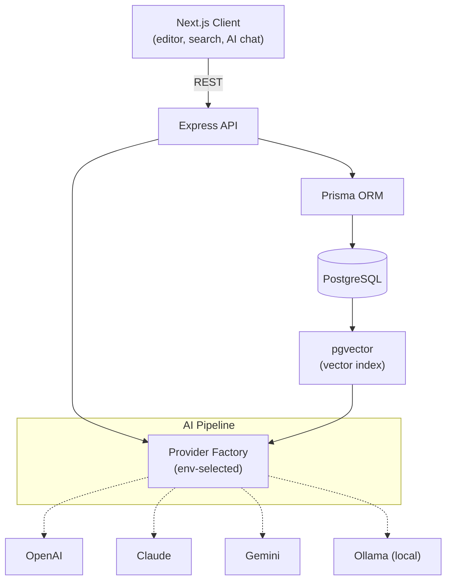
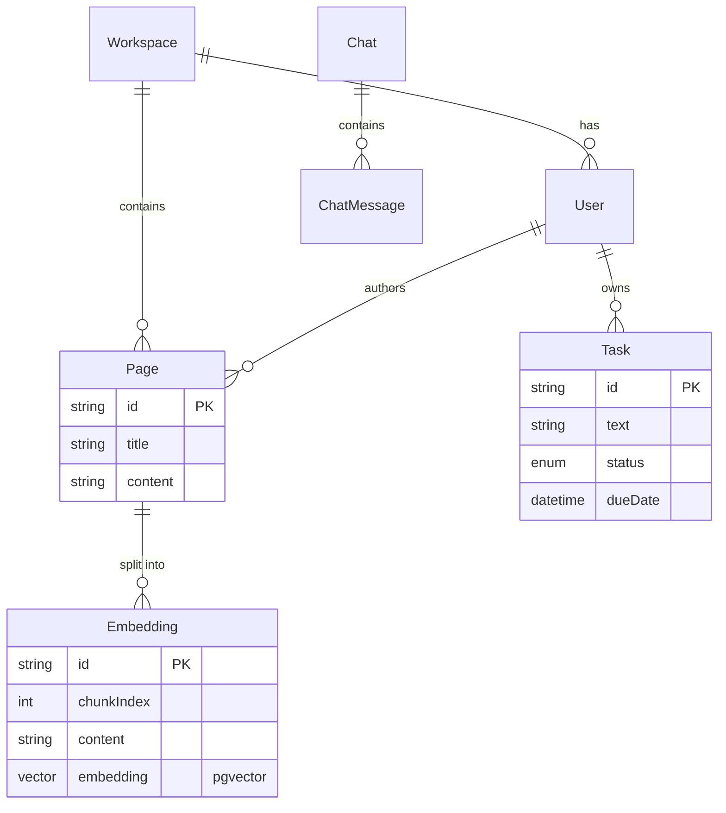

# WorkspaceGPT

An AI-native workspace that indexes your notes, documents, and tasks. The idea is simple: instead of pasting one document into ChatGPT and asking about it, you ask questions across everything you've ever written, and the answer comes from your own notes.

So if you ask *"What projects mention CUDA?"*, it searches your workspace, not the public internet.

## What it does

- Answers questions across your whole workspace (RAG over your own notes)
- Semantic search that matches on meaning instead of exact keywords
- AI summaries: TLDR, key ideas, risks, next steps
- Pulls action items out of free text and meeting notes
- Suggests related pages using vector similarity
- Lets you swap the AI provider between OpenAI, Claude, Gemini, or a fully local Ollama setup

## Why I built it

I wanted to actually understand how AI-native knowledge tools work under the hood rather than just use them, so I built one. The interesting part turned out not to be calling the model. It was everything around it: splitting documents into chunks that retrieve well, getting embeddings and vector search to return the *right* context, and keeping the provider layer clean enough that swapping models doesn't ripple through the codebase. Most of what I learned came from the retrieval side, not the prompting.

## Architecture



### The RAG loop


It's a fairly standard Retrieval-Augmented Generation setup. The model never sees your whole workspace, only the handful of chunks most relevant to the question. That keeps answers grounded in your actual notes and makes it possible to cite which page each answer came from.

## Data model



Each page is split into overlapping chunks, and every chunk gets its own embedding row. The overlap matters: without it, a chunk boundary can cut a sentence in half and you lose the context around it. Storing chunks separately also means retrieval can return the most relevant *section* of a long document instead of dragging back the whole thing.

## Tech stack

| Layer | Choice |
|---|---|
| Frontend | React, TypeScript, Next.js (App Router) |
| Backend | Node.js, Express |
| Database | PostgreSQL with pgvector |
| ORM | Prisma |
| Embeddings & LLM | OpenAI, Claude, Gemini, Ollama (swappable) |
| Auth (boundary ready) | Clerk / Auth.js |
| Tests | Vitest |
| CI | GitHub Actions (lint, format, test, build) |

## Swappable AI providers

Every AI call goes through one small interface (`ChatProvider` / `EmbeddingProvider`), so changing the model behind the app is a single environment variable and touches no business logic.

```env
LLM_PROVIDER=claude          # openai | claude | gemini | ollama
EMBEDDING_PROVIDER=ollama    # openai | gemini | ollama  (Claude has no embeddings API)
EMBEDDING_DIM=768            # must match the provider's model and the vector(N) column
```

If you want everything to run locally with no API cost, point both providers at Ollama.

One catch worth knowing: the embedding dimension has to match across `EMBEDDING_DIM`, the provider's model, and the `vector(N)` column in `schema.prisma`. If they don't line up, vector search silently breaks. The per-model values are listed in `.env.example`.

## API

| Method | Route | Description |
|---|---|---|
| `POST` | `/pages` | Create a page (auto-embeds it) |
| `GET` | `/pages` | List pages |
| `GET` | `/pages/:id` | Get a page |
| `PATCH` | `/pages/:id` | Update a page (re-embeds) |
| `DELETE` | `/pages/:id` | Delete a page |
| `GET` | `/pages/:id/related` | Related pages via vector similarity |
| `POST` | `/chat` | Ask a question across the workspace (RAG) |
| `GET` | `/search?q=` | Semantic search |
| `POST` | `/embed/:pageId` | Manually (re)index a page |
| `POST` | `/summarize` | TLDR, key ideas, risks, next steps |
| `POST` | `/tasks` | Extract and save tasks from text |
| `GET` | `/tasks` | List tasks |
| `PATCH` | `/tasks/:id` | Toggle task status |

Example:

```bash
curl -s localhost:4000/chat -X POST -H 'content-type: application/json' \
  -d '{"question":"What have I learned about FPGA development?"}'
```

## Running it locally

You'll need Node 20+ and Docker (for Postgres with pgvector).

```bash
# 1. Install
npm install

# 2. Start Postgres with pgvector
npm run db:up

# 3. Configure (add an OPENAI_API_KEY, or switch providers)
cp .env.example .env

# 4. Create the schema (this also enables the vector extension)
npm run prisma:generate
npm run prisma:migrate

# 5. Run the API and client together
npm run dev                 # API on :4000, client on :3000

# 6. Optional: seed some demo notes, then try the AI
npx tsx scripts/seed.ts
```

Open http://localhost:3000, write a note, then open the AI panel and ask it something.

## Project layout

```
workspace-ai/
├── client/            Next.js frontend (editor, search, AI chat)
├── server/            Express API
│   └── src/
│       ├── ai/        provider abstraction (openai, claude, gemini, ollama)
│       ├── services/  chunking, embeddings/vector-search, RAG, summaries, tasks
│       └── routes/    REST endpoints
├── packages/shared/   types shared by client and server
├── prisma/            schema (pgvector model)
└── scripts/           seed script
```

## Tests and CI

```bash
npm test               # Vitest
```

On every push and PR, GitHub Actions runs Prettier, ESLint, Vitest, and a full build against a live pgvector container.

## Status and what's next

The core works end to end. The full RAG loop (chunk, embed, store, retrieve, answer), semantic search, summaries, task extraction, related pages, the multi-provider layer, the schema, CI, and a working client are all implemented and runnable.

The items below are stubbed as clear extension points, which I'd tackle next:

- [ ] Wire real auth (Clerk / Auth.js) into the `withContext` middleware boundary
- [ ] Streaming chat responses (SSE)
- [ ] Rich-text editor with slash commands (`/table`, `/code`, `/summary`)
- [ ] Knowledge-graph visualization built from chunk similarity
- [ ] Meeting-notes endpoint (summary, action items, deadlines, questions)
- [ ] Debounced re-embedding plus a background job queue
- [ ] Playwright E2E and React Testing Library component tests
