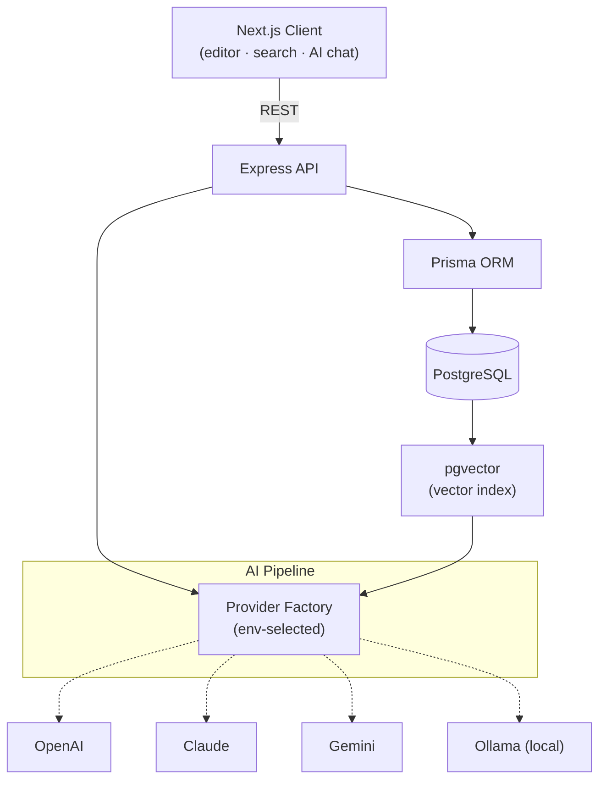
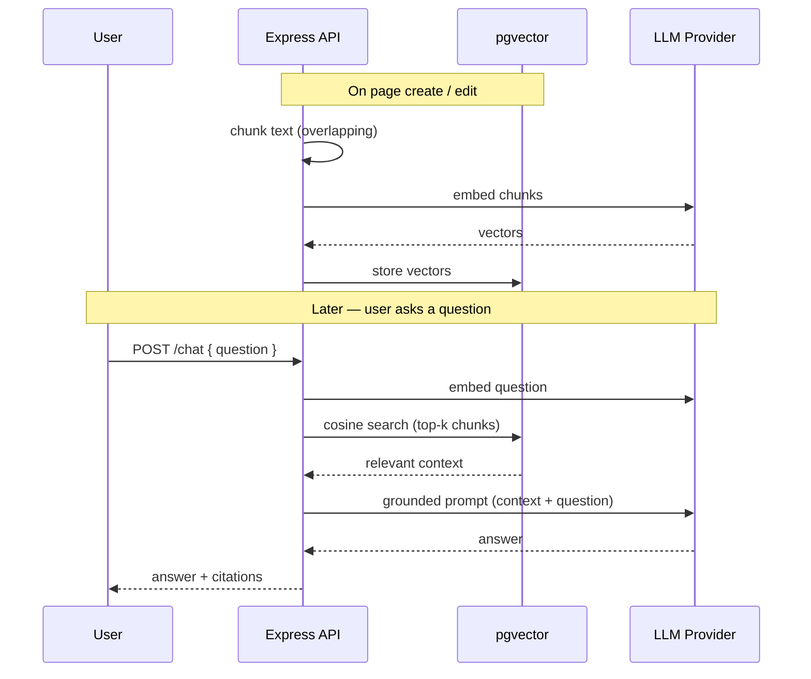
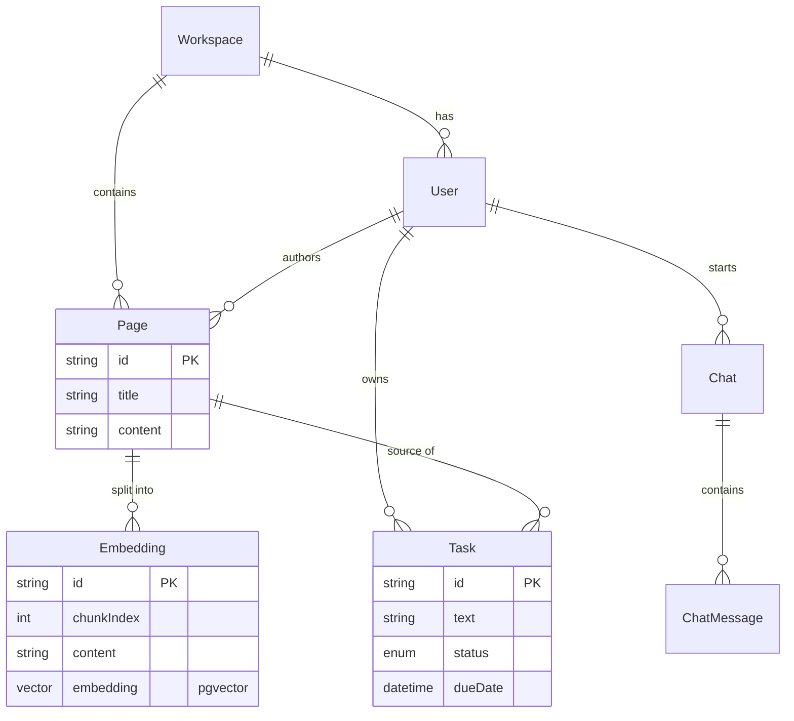

# WorkspaceGPT — AI-Native Workspace

An AI-native workspace that indexes your notes, documents, and tasks. Instead of asking ChatGPT about one document, you ask questions across your **whole** knowledge base.

> Ask: _"What projects mention CUDA?"_ → it searches your notes, not the public internet.

- **Ask questions across your workspace** (RAG over your own notes)
- **Semantic search** — meaning, not keywords
- **AI summaries** — TLDR, key ideas, risks, next steps
- **Automatic task extraction** from free text and meeting notes
- **Related pages** via vector similarity
- **Pluggable AI providers** — OpenAI, Claude, Gemini, or fully-local Ollama

---

## Architecture



### The RAG loop



This is classic Retrieval-Augmented Generation: the model only sees the most relevant slices of your notes, so answers stay grounded and cite their sources.

---

## Data model (ER diagram)



A page is split into overlapping **chunks**; each chunk gets its own embedding row, so retrieval can return the most relevant *section* of a long document rather than the whole thing.

---

## Tech stack

| Layer | Choice |
|---|---|
| Frontend | React, TypeScript, Next.js (App Router) |
| Backend | Node.js, Express |
| Database | PostgreSQL + **pgvector** |
| ORM | Prisma |
| Embeddings & LLM | OpenAI · Claude · Gemini · Ollama (swappable) |
| Auth (boundary ready) | Clerk / Auth.js |
| Tests | Vitest |
| CI | GitHub Actions (lint · format · test · build) |

---

## Pluggable AI providers

The differentiator: every AI call goes through a small interface (`ChatProvider` / `EmbeddingProvider`). Switching the brain of the app is **one env var** — no business-logic changes.

```env
LLM_PROVIDER=claude          # openai | claude | gemini | ollama
EMBEDDING_PROVIDER=ollama    # openai | gemini | ollama  (Claude has no embeddings API)
EMBEDDING_DIM=768            # must match the provider + the vector(N) column
```

Want privacy / zero API cost? Point both at **Ollama** and everything runs locally.

> ⚠️ The embedding dimension must match across `EMBEDDING_DIM`, your provider's model, and the `vector(N)` column in `schema.prisma`. Mixing dimensions breaks vector search. See `.env.example` for the per-model values.

---

## API

| Method | Route | Description |
|---|---|---|
| `POST` | `/pages` | Create a page (auto-embeds it) |
| `GET` | `/pages` | List pages |
| `GET` | `/pages/:id` | Get a page |
| `PATCH` | `/pages/:id` | Update a page (re-embeds) |
| `DELETE` | `/pages/:id` | Delete a page |
| `GET` | `/pages/:id/related` | Related pages (vector similarity) |
| `POST` | `/chat` | Ask a question across the workspace (RAG) |
| `GET` | `/search?q=` | Semantic search |
| `POST` | `/embed/:pageId` | Manually (re)index a page |
| `POST` | `/summarize` | TLDR / key ideas / risks / next steps |
| `POST` | `/tasks` | Extract + save tasks from text |
| `GET` | `/tasks` | List tasks |
| `PATCH` | `/tasks/:id` | Toggle task status |

Example:

```bash
curl -s localhost:4000/chat -X POST -H 'content-type: application/json' \
  -d '{"question":"What have I learned about FPGA development?"}'
```

---

## Setup

**Prerequisites:** Node 20+, Docker (for Postgres+pgvector).

```bash
# 1. Install
npm install

# 2. Start Postgres with pgvector
npm run db:up

# 3. Configure
cp .env.example .env        # add an OPENAI_API_KEY (or switch providers)

# 4. Create the schema (also enables the vector extension)
npm run prisma:generate
npm run prisma:migrate

# 5. Run API + client together
npm run dev                 # API :4000, client :3000

# 6. (optional) Seed demo notes, then try the AI
npx tsx scripts/seed.ts
```

Open http://localhost:3000, write a note, then hit the **✦ AI** button and ask something.

---

## Project layout

```
workspace-ai/
├── client/            Next.js frontend (editor, search, AI chat)
├── server/            Express API
│   └── src/
│       ├── ai/        provider abstraction (openai · claude · gemini · ollama)
│       ├── services/  chunking · embeddings/vector-search · RAG · summaries · tasks
│       └── routes/    REST endpoints
├── packages/shared/   types shared by client + server
├── prisma/            schema (pgvector model)
└── scripts/           seed script
```

---

## Tests & CI

```bash
npm test               # Vitest
```

GitHub Actions runs Prettier, ESLint, Vitest, and a full build against a live pgvector container on every push/PR.

---

## Status & roadmap

This repo is a **working foundation**: the full RAG loop (chunk → embed → store → retrieve → answer), semantic search, summaries, task extraction, related pages, the multi-provider layer, schema, CI, and a functional client are all implemented and runnable.

Built as clearly-marked extension points, ready to grow into:

- [ ] Wire real auth (Clerk / Auth.js) into the `withContext` middleware boundary
- [ ] Streaming chat responses (SSE)
- [ ] Rich-text / slash-command editor (`/table`, `/code`, `/summary`)
- [ ] Knowledge-graph visualization from chunk similarity
- [ ] Meeting-notes endpoint (summary · action items · deadlines · questions)
- [ ] Flashcards / quiz / timeline generators
- [ ] Debounced re-embedding + background job queue
- [ ] Playwright E2E + React Testing Library component tests
